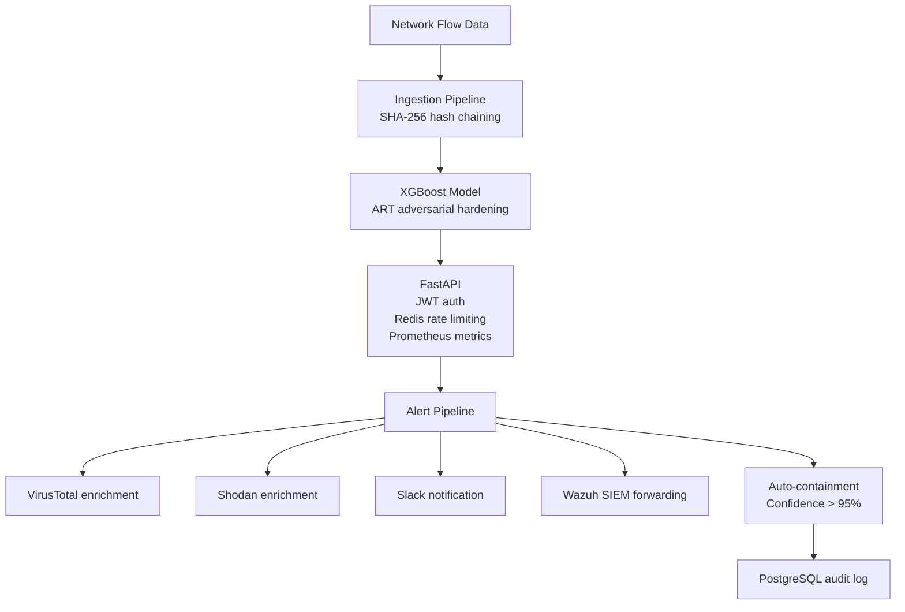

# SecOpsAI


A production-grade Security Operations Center (SOC) tool that ingests raw network flow data, runs it through a hardened ML model, exposes results via a secured REST API, and fires alerts through an automated response pipeline.

---

## Prerequisites

- Docker and Docker Compose
- Python 3.11 (pyenv recommended)
- Make
- Git

---

## Quick Start

```bash
# 1. Clone the repo
git clone https://github.com/WaheedX-code/SecOpsAI.git
cd SecOpsAI

# 2. Set up environment
cp .env.example .env
nano .env  # Fill in required values

# 3. Install dependencies and train model
make setup
make train

# 4. Start all services
make start

#5. Restart the alert pipeline
make stop && make start
```

Services:
- API: http://localhost:8000
- Grafana: http://localhost:3000
- Prometheus: http://localhost:9090
- MLflow: http://localhost:5000

---

## Environment Setup

Required values in `.env`:

```env
POSTGRES_PASSWORD=your_strong_password
POSTGRES_USER=secopsai
POSTGRES_DB=secopsai
JWT_SECRET_KEY=your_long_random_string
ADMIN_PASSWORD=your_admin_password
ANALYST_PASSWORD=your_analyst_password
```
Optional Integrations (skip if not configured):
```env
VIRUSTOTAL_API_KEY=
SHODAN_API_KEY=
SLACK_WEBHOOK_URL=
GRAFANA_PASSWORD=
```
---

## API Usage

Get a token:
```bash
curl -X POST http://localhost:8000/auth/token \
  -H "Content-Type: application/json" \
  -d '{"username": "admin", "password": "your_admin_password"}'
```
### Sample detection response
```json
{
  "prediction": "DDoS",
  "confidence": 0.97,
  "alert_fired": true,
  "containment": "auto-block triggered",
  "audit_id": "a3f2c1d0-..."
}
```

Run a detection:
```bash
curl -X POST http://localhost:8000/detect \
  -H "Authorization: Bearer YOUR_TOKEN" \
  -H "Content-Type: application/json" \
  -d '{"features": [0.1, 0.5, 1.2]}'
```

View audit logs:
```bash
curl http://localhost:8000/audit/logs \
  -H "Authorization: Bearer YOUR_TOKEN"
```

Check metrics:
```bash
curl http://localhost:8080/metrics
```

---

## Architecture


---

## Wazuh SIEM Integration

SecOpsAI can forward alerts to your Wazuh manager via syslog. This is disabled by default.

### Setup

1. Add these to your `.env`:

```env
WAZUH_ENABLED=true
WAZUH_HOST=your_wazuh_manager_ip
WAZUH_PORT=514
WAZUH_PROTOCOL=udp
```

---

## Troubleshooting

**API won't start** 
- Check all required `.env` vars are set
- Ensure `make train` has been run and model files exist in detection/models/
- Check logs: `make logs`

**Grafana no data**
- Confirm Prometheus data source is set to `http://prometheus:9090`, if not set it to `http://prometheus:9090`
- Ensure all containers are running: `make status`

**Database errors**
- Run migrations manually: `psql -h localhost -U secopsai -d secopsai -f db/migrations/001_audit_logs.sql`

**Redis unavailable**
- Rate limiting will skip gracefully — this is expected behaviour
- Check Redis container: `docker-compose ps`

---

## Developer Commands

| Command | Description |
|---|---|
| `make setup` | Install dependencies |
| `make train` | Train ML model |
| `make test` | Run test suite |
| `make start` | Start all services |
| `make stop` | Stop all services |
| `make logs` | Tail logs |
| `make status` | Show service status |
| `make stop && make start` | Restart the alert pipeline |

---

## Security Notes

- JWT tokens expire after 60 minutes
- Rate limiting: 60 requests/minute per IP
- All credentials via environment variables
- Audit log writes to PostgreSQL with flat-file fallback
- Model hardened against adversarial attacks using IBM ART


