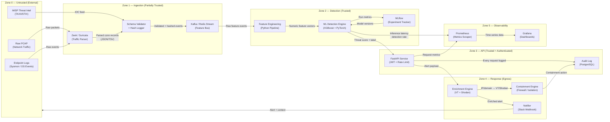

```mermaid
flowchart LR
    %% ─── ZONE 0: Untrusted External ───
    subgraph Z0 ["Zone 0 — Untrusted (External)"]
        PCAP["Raw PCAP\n(Network Traffic)"]
        LOGS["Endpoint Logs\n(Sysmon / OS Events)"]
        INTEL["MISP Threat Intel\n(TAXII/STIX)"]
    end

    %% ─── ZONE 1: Ingestion ───
    subgraph Z1 ["Zone 1 — Ingestion (Partially Trusted)"]
        ZEEK["Zeek / Suricata\n(Traffic Parser)"]
        VALIDATOR["Schema Validator\n+ Hash Logger"]
        KAFKA["Kafka / Redis Stream\n(Feature Bus)"]
    end

    %% ─── ZONE 2: Detection ───
    subgraph Z2 ["Zone 2 — Detection (Trusted)"]
        FEATURES["Feature Engineering\n(Python Pipeline)"]
        MODEL["ML Detection Engine\n(XGBoost + PyTorch)"]
        MLFLOW["MLflow\n(Experiment Tracker)"]
    end

    %% ─── ZONE 3: API ───
    subgraph Z3 ["Zone 3 — API (Trusted + Authenticated)"]
        API["FastAPI Service\n(JWT + Rate Limit)"]
        AUDITLOG["Audit Log\n(PostgreSQL)"]
    end

    %% ─── ZONE 4: Response ───
    subgraph Z4 ["Zone 4 — Response (Egress)"]
        ENRICHER["Enrichment Engine\n(VT + Shodan)"]
        RESPONDER["Containment Engine\n(Firewall / Isolation)"]
        NOTIFIER["Notifier\n(Slack Webhook)"]
    end

    %% ─── ZONE 5: Observability ───
    subgraph Z5 ["Zone 5 — Observability"]
        PROMETHEUS["Prometheus\n(Metrics Scraper)"]
        GRAFANA["Grafana\n(Dashboards)"]
    end

    %% ─── DATA FLOWS ───
    PCAP -->|"Raw packets"| ZEEK
    LOGS -->|"Raw events"| ZEEK
    INTEL -->|"IOC feed"| VALIDATOR

    ZEEK -->|"Parsed conn records\n(JSON/TSV)"| VALIDATOR
    VALIDATOR -->|"Validated + hashed events"| KAFKA

    KAFKA -->|"Raw feature events"| FEATURES
    FEATURES -->|"Numeric feature vectors"| MODEL
    MODEL -->|"Threat score + label"| API
    MODEL -->|"Run metrics"| MLFLOW
    MLFLOW -->|"Model versions"| MODEL

    API -->|"Every request logged"| AUDITLOG
    API -->|"Alert payload"| ENRICHER

    ENRICHER -->|"IP/domain → VT/Shodan"| RESPONDER
    ENRICHER -->|"Enriched alert"| NOTIFIER
    RESPONDER -->|"Containment action"| AUDITLOG
    NOTIFIER -->|"Alert + context"| Z0

    MODEL -->|"Inference latency\ndetection rate"| PROMETHEUS
    API -->|"Request metrics"| PROMETHEUS
    PROMETHEUS -->|"Time-series data"| GRAFANA
```
