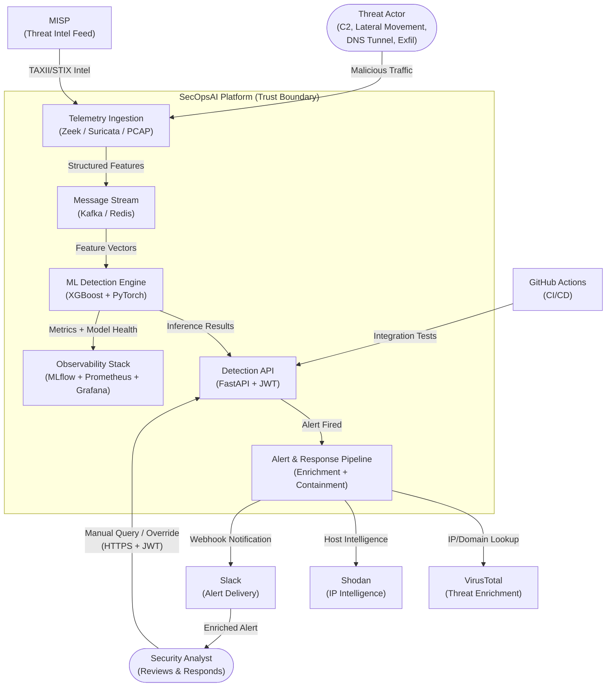

```mermaid
flowchart TB
    %% External Actors
    ATTACKER(["Threat Actor\n(C2, Lateral Movement,\nDNS Tunnel, Exfil)"])
    ANALYST(["Security Analyst\n(Reviews & Responds)"])

    %% External Systems
    VT["VirusTotal\n(Threat Enrichment)"]
    SHODAN["Shodan\n(IP Intelligence)"]
    SLACK["Slack\n(Alert Delivery)"]
    MISP["MISP\n(Threat Intel Feed)"]
    CICD["GitHub Actions\n(CI/CD)"]

    %% Trust Boundary
    subgraph SECOPSAI ["SecOpsAI Platform (Trust Boundary)"]
        INGEST["Telemetry Ingestion\n(Zeek / Suricata / PCAP)"]
        STREAM["Message Stream\n(Kafka / Redis)"]
        DETECT["ML Detection Engine\n(XGBoost + PyTorch)"]
        API["Detection API\n(FastAPI + JWT)"]
        RESPONSE["Alert & Response Pipeline\n(Enrichment + Containment)"]
        OBS["Observability Stack\n(MLflow + Prometheus + Grafana)"]
    end

    %% Data Flows
    ATTACKER -->|"Malicious Traffic"| INGEST
    MISP -->|"TAXII/STIX Intel"| INGEST
    INGEST -->|"Structured Features"| STREAM
    STREAM -->|"Feature Vectors"| DETECT
    DETECT -->|"Inference Results"| API
    DETECT -->|"Metrics + Model Health"| OBS
    API -->|"Alert Fired"| RESPONSE
    RESPONSE -->|"IP/Domain Lookup"| VT
    RESPONSE -->|"Host Intelligence"| SHODAN
    RESPONSE -->|"Webhook Notification"| SLACK
    SLACK -->|"Enriched Alert"| ANALYST
    ANALYST -->|"Manual Query / Override\n(HTTPS + JWT)"| API
    CICD -->|"Integration Tests"| API
```
